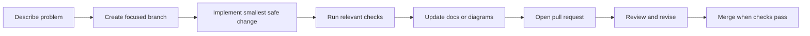
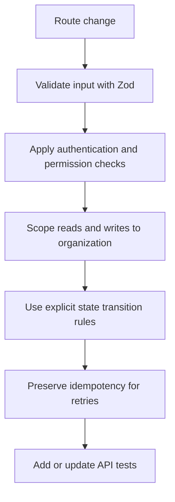
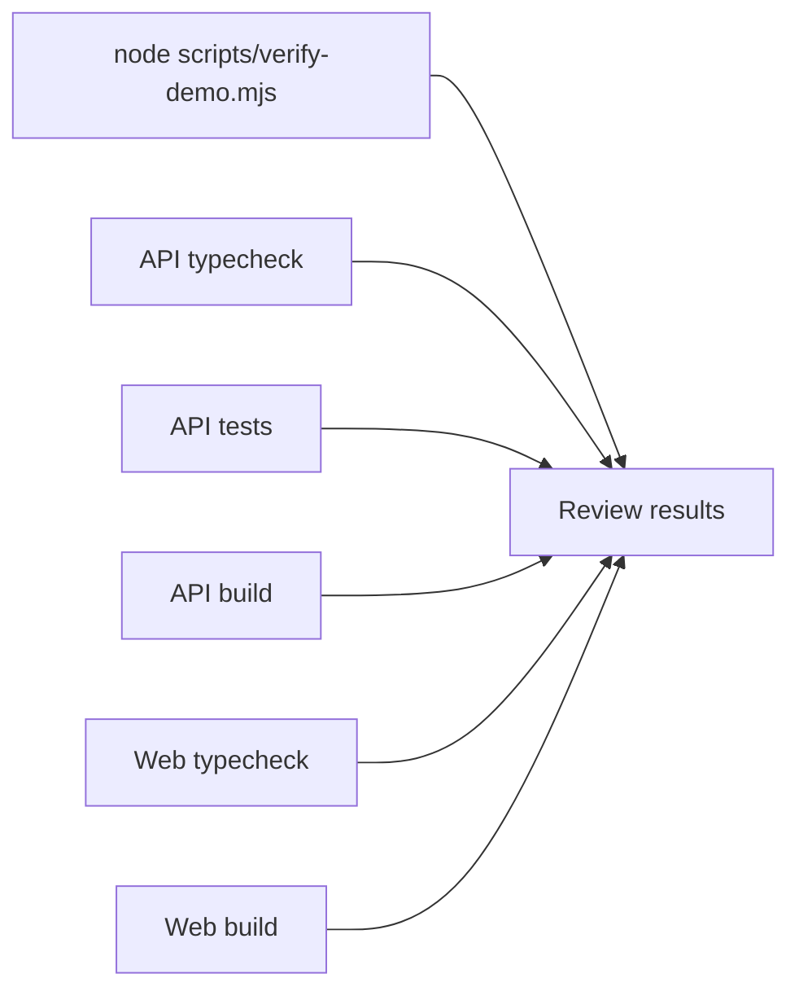
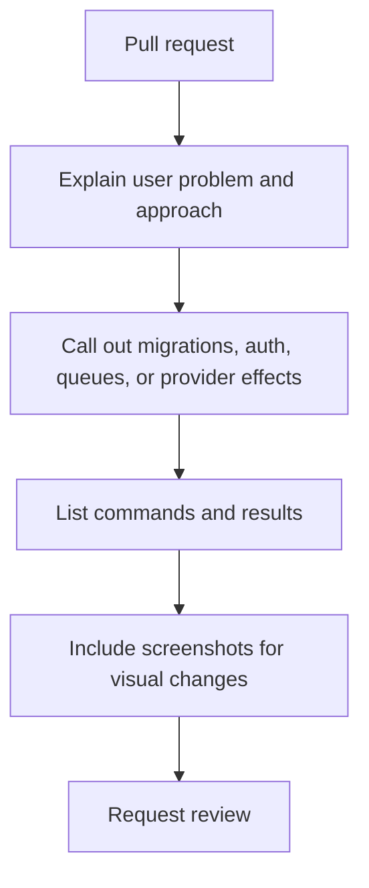

# Contributing To Neev

Neev is a small marketplace prototype with a production-shaped API. Keep changes focused, explain the user problem, and leave the demo safer and clearer than you found it.

## Change Flow



## Before Coding

- Start from the current `main` branch.
- Search for an existing route, rule, test, or diagram before adding a new one.
- Keep fictional demo records obviously fictional.
- Never add passwords, API keys, payment secrets, private keys, or real customer data.
- Do not claim that a browser demo action completed a real remote operation.

## Backend Changes



- Keep PostgreSQL as the source of truth for users, organizations, inventory, quotes, orders, payments, dispatch, and audit records.
- Use `AUTH_REQUIRE_USER_LOOKUP=true` for real environments.
- Treat BullMQ payloads as JSON. Serialize dates and other non-JSON values before enqueueing.
- Keep webhook signature verification on the raw request body.
- Add a committed Prisma migration for schema changes.
- Do not use MongoDB for transactional order state. Read [`docs/database-decision.md`](docs/database-decision.md) before adding Mongo documents.

## Frontend And Demo Changes

- Preserve the existing visual language and responsive behavior.
- Keep the no-build demo usable without an API or login.
- Keep the Next.js workspace and static demo boundaries clear in copy and code.
- Reuse the selected Neev logo assets rather than adding duplicate branding.
- Update a screenshot only when the visible product flow changes.

## Verification



Run the checks that apply to your change:

```bash
node scripts/verify-demo.mjs

cd apps/api
npm run typecheck
npm test -- --run
npm run build
npx prisma validate
npx prisma generate

cd ../web
npm run typecheck
npm run build
```

If a command cannot run because PostgreSQL, Redis, or MongoDB is unavailable, state that clearly in the pull request. Do not weaken production validation just to make a local test pass.

## Pull Requests



Use a short title. The description should include:

- the user-visible or operational problem
- the smallest meaningful change
- migrations or environment variables
- security and authorization impact
- test commands and results
- screenshots or diagrams for visual or architectural changes

## Review Standard

Reviewers look for authorization bypasses, cross-organization data access, invalid state transitions, non-idempotent retries, raw secret leakage, unbounded request or queue work, and documentation that no longer matches the code. A small change that is easy to verify is preferred over a broad refactor.
