# Neev

Neev is a production-shaped B2B marketplace for sourcing red bricks from local kilns in the NCR East launch area. It turns a fragmented material purchase into one visible path: search, quote, payment, dispatch, delivery proof, and reconciliation.

The repository contains a no-build browser demo, a Next.js workspace, and an Express API. Demo records are fictional. The demo does not take real payments, reserve real stock, or send a real truck.

**Live demo:** [neev-web.onrender.com](https://neev-web.onrender.com)
**API readiness:** [neev-api-adnc.onrender.com/api/v1/health/ready](https://neev-api-adnc.onrender.com/api/v1/health/ready)
**API documentation:** `/api/v1/docs` on a running API

## Product Loop

```mermaid
flowchart LR
  Need[Buyer need] --> Search[Search inventory]
  Search --> Request[Request a quote]
  Request --> Compare[Compare delivered cost]
  Compare --> Accept[Accept a quote]
  Accept --> Pay[Verify payment]
  Pay --> Dispatch[Schedule dispatch]
  Dispatch --> Proof[Receive delivery proof]
  Proof --> Reconcile[Reconcile quantity]
```

The browser demo makes this loop easy to explore. The API repeats every important authorization, validation, state, and idempotency check on the server.

## Screenshots

<p align="center">
  
  
</p>

## System Shape

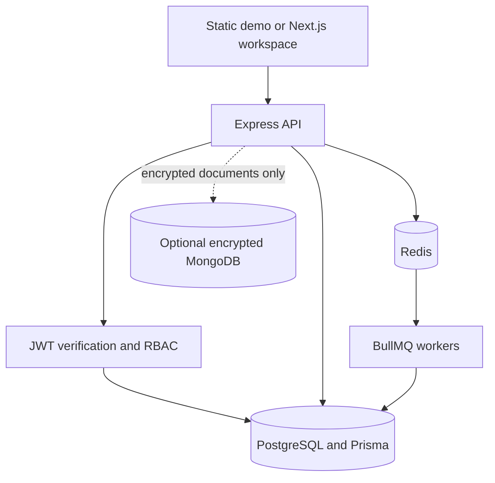

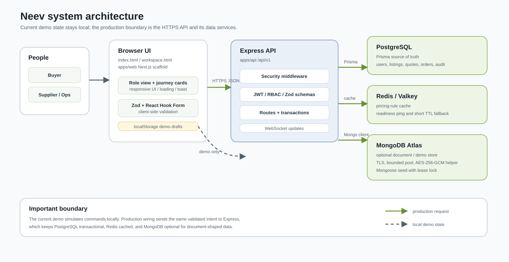

### Request Boundary

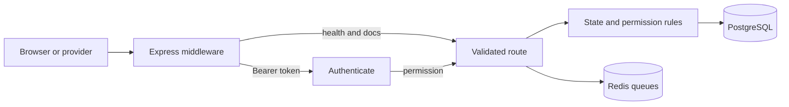

### Trust Boundary

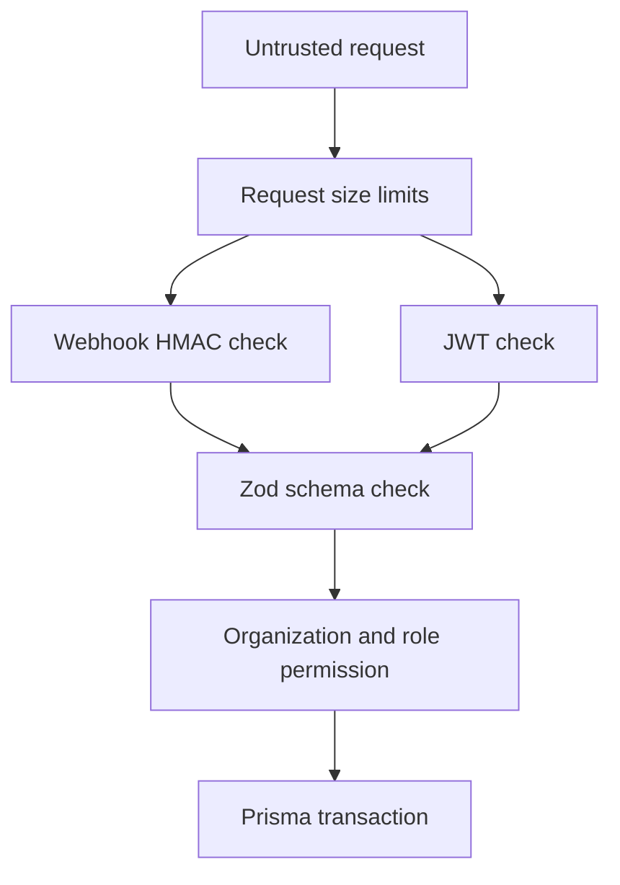

## Authentication

Neev accepts short-lived access JWTs issued by the identity boundary. It does not accept arbitrary signed payloads just because the signature is valid.

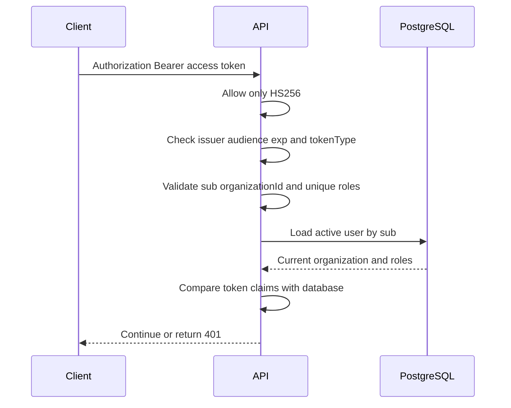

Required access-token claims are:

```text
sub             user id
organizationId  current organization id
roles           one or more unique roles
tokenType       access
iat             issued-at timestamp
exp             expiry timestamp
```

`AUTH_REQUIRE_USER_LOOKUP=true` is the production default. Deactivating a user or changing its organization or roles invalidates previously issued tokens on the next request.

### Roles And Permissions

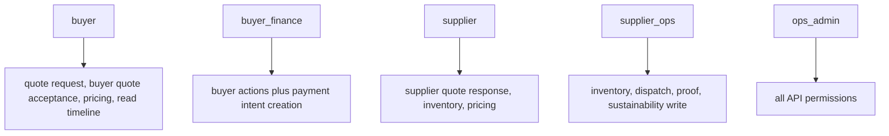

Permission checks are explicit and organization-scoped. A valid token with the wrong role returns `403`; a missing or invalid token returns `401`.

## Marketplace State

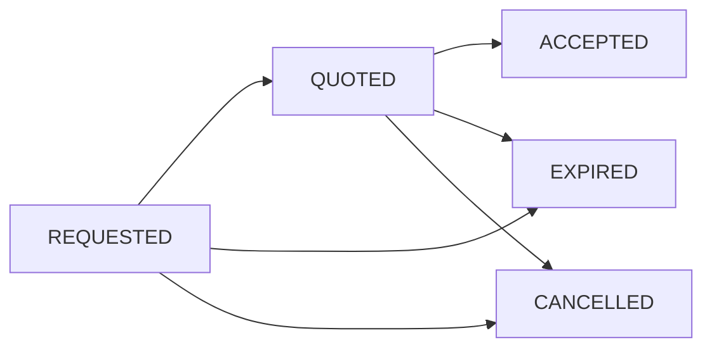

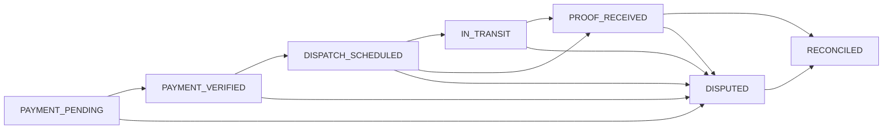

Routes and workers call the same transition rules. A state cannot be changed by directly writing a plausible-looking status.

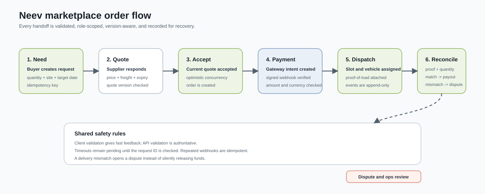

## Payments And Background Jobs

Provider webhooks are acknowledged quickly, then processed by a worker. The raw body is checked before JSON parsing, and the `(gateway, eventId)` pair is unique in both the database ledger and the queue job identity.

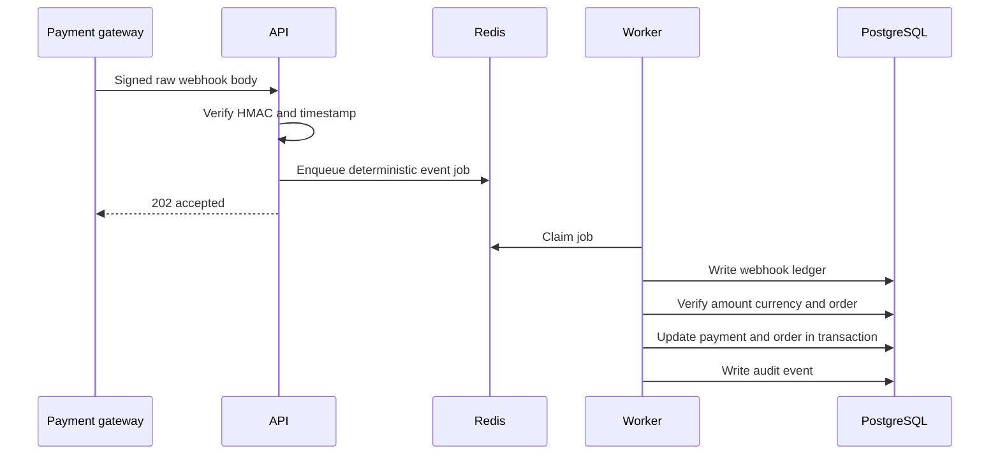

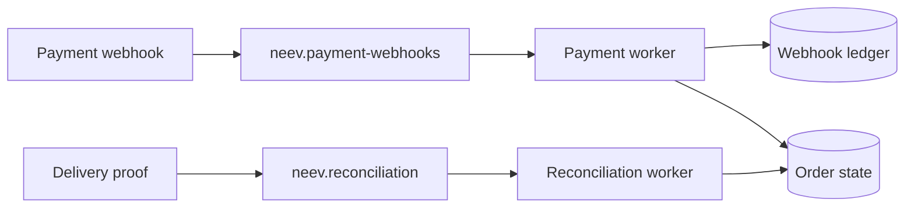

Both queues use five attempts with exponential backoff. Completed and failed jobs are retained for bounded operational inspection. Repeated webhook or reconciliation requests resolve to the same job identity.

## Data Ownership

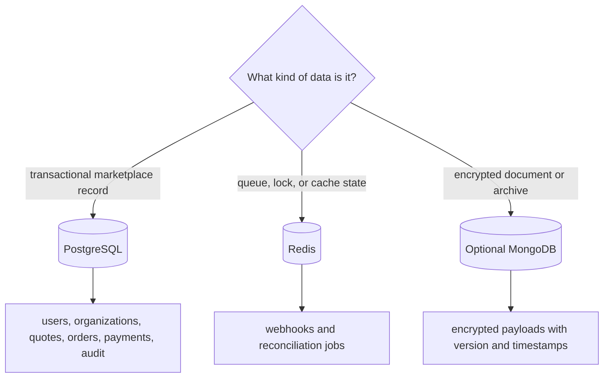

### MongoDB Decision

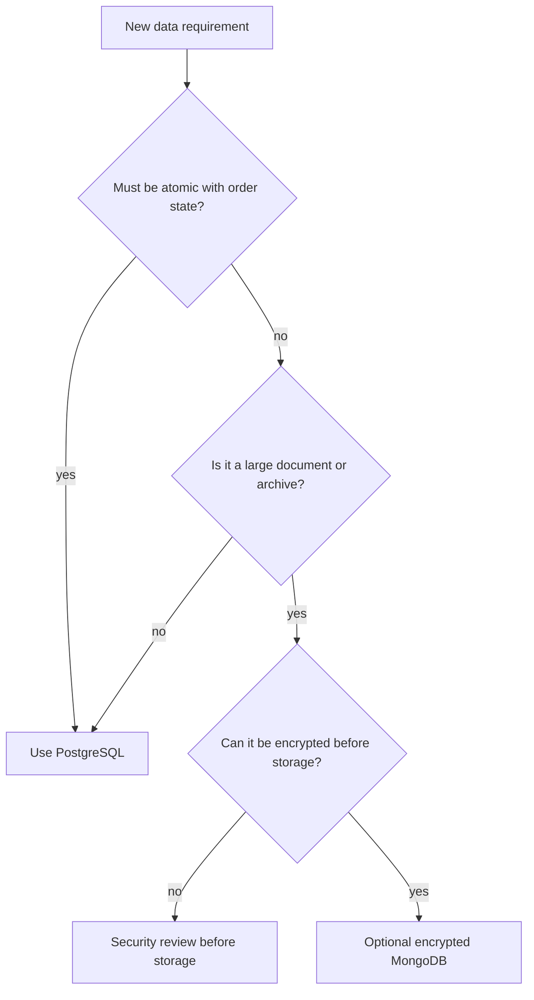

MongoDB is not a second source of truth for orders, payments, inventory, or permissions. It is opt-in, requires a 32-byte encryption key, and is disabled when `MONGODB_URL` is absent. See [`docs/database-decision.md`](docs/database-decision.md).

## API Map

```mermaid
flowchart TB
  API[/api/v1]
  API --> Health[/health]
  API --> Docs[/docs]
  API --> Auth[/auth]
  API --> Search[/search]
  API --> Quotes[/quote-requests and /quotes]
  API --> Payment[/payment-intents and /payments]
  API --> Pricing[/pricing]
  API --> Supply[/inventory and /sustainability]
  API --> Delivery[/dispatches and /orders]
```

| Area | Main behavior |
| --- | --- |
| `/health` | Liveness and dependency readiness |
| `/auth` | Password login, rotating refresh cookie, logout, and current-user lookup |
| `/search` | Authenticated catalog search with safe filters |
| `/quote-requests` | Organization-scoped quote creation and idempotency |
| `/quotes` | Supplier responses and buyer acceptance |
| `/payment-intents` | Payment intent creation for authorized finance users |
| `/payments/:gateway/webhook` | HMAC-verified webhook queueing |
| `/pricing` | Delivered price calculation |
| `/sustainability` | Read and write sustainability metrics |
| `/inventory` | Supplier inventory updates |
| `/dispatches` | Dispatch scheduling and delivery proof |
| `/orders/:id/timeline` | Organization-scoped order timeline |

OpenAPI JSON is available at `/api/v1/docs/openapi.json`. Swagger UI is available at `/api/v1/docs`.

## Repository Map

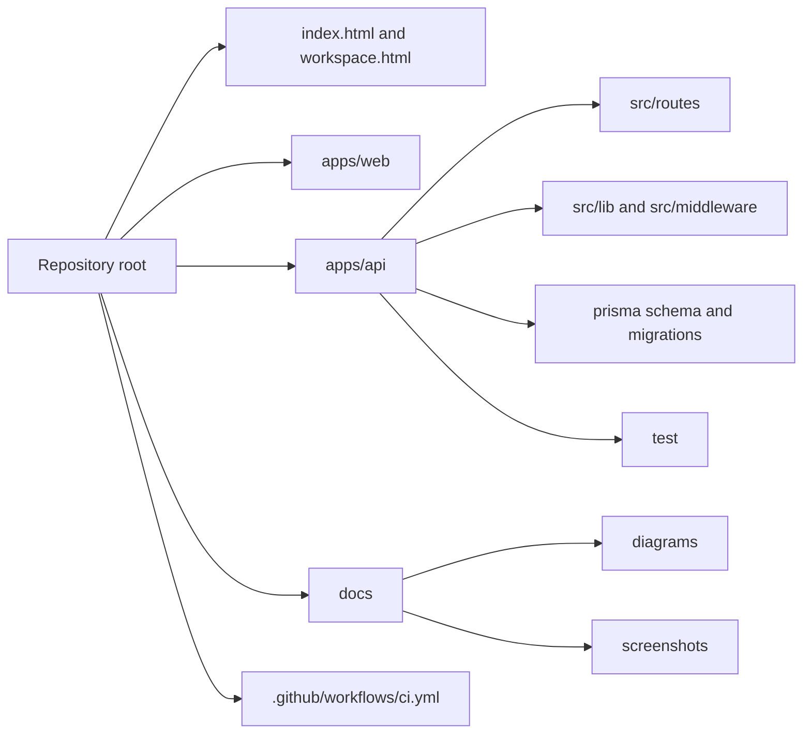

| Path | Purpose |
| --- | --- |
| `index.html` | Public no-build demo |
| `workspace.html` | Buyer, supplier, and operations demo |
| `apps/web/` | Next.js workspace and shared components |
| `apps/api/src/routes/` | Express route adapters |
| `apps/api/src/lib/` | Auth, RBAC, state, queues, audit, data access, and realtime |
| `apps/api/prisma/` | PostgreSQL schema and committed migrations |
| `apps/api/test/` | API, authorization, state, queue, and encryption tests |
| `docs/diagrams/` | Detailed SVG architecture and workflow diagrams |
| `docs/screenshots/` | README screenshots |
| `.github/workflows/ci.yml` | Quality gates and static demo deployment |

## Local Setup

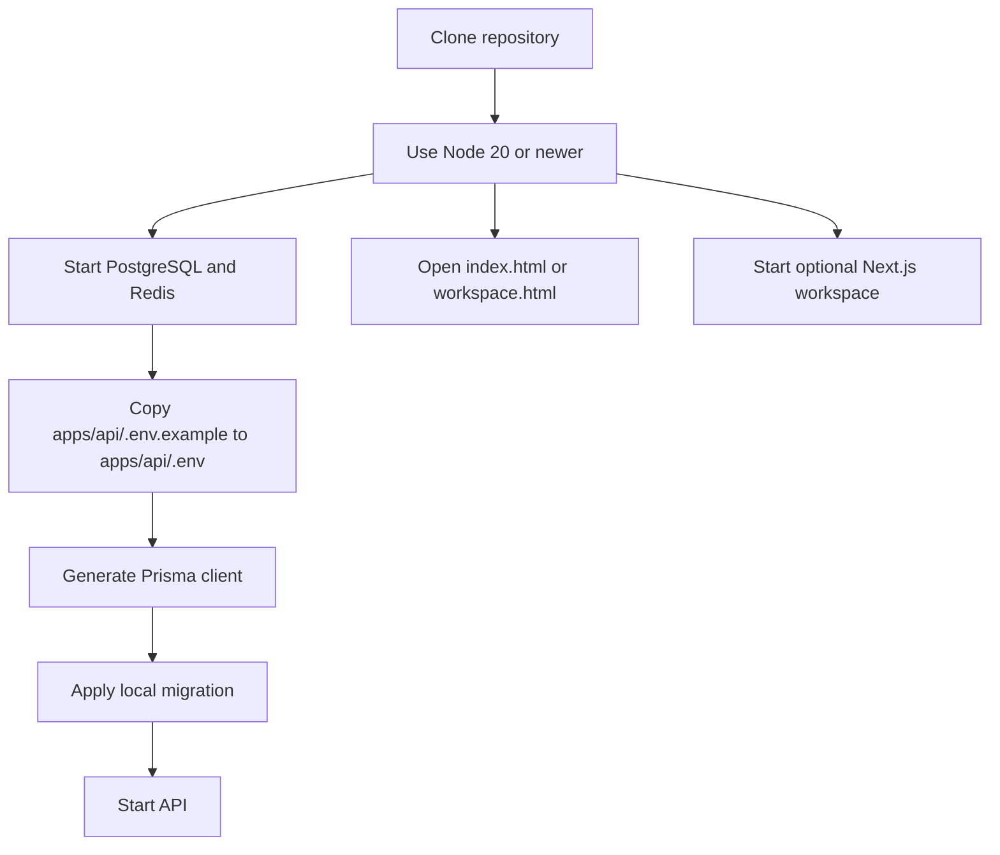

### Browser Demo

The no-build demo needs no install:

```bash
open index.html
open workspace.html
```

On Windows, open the files from Explorer instead of using `open`.

### Next.js Workspace

```bash
cd apps/web
npm ci
cp .env.example .env.local
npm run dev
```

### API

```bash
cd apps/api
npm ci
cp .env.example .env
npx prisma generate
npx prisma migrate dev
npm run dev
```

The API requires PostgreSQL and Redis. MongoDB is optional and should only be enabled when its encrypted-document use case is understood:

```bash
cd apps/api
npm run seed:mongoose
```

Run background workers separately when `RUN_WORKERS=false`:

```bash
npm run dev:worker
```

Never commit `.env`, provider secrets, passwords, payment credentials, private keys, or real customer data.

## Configuration

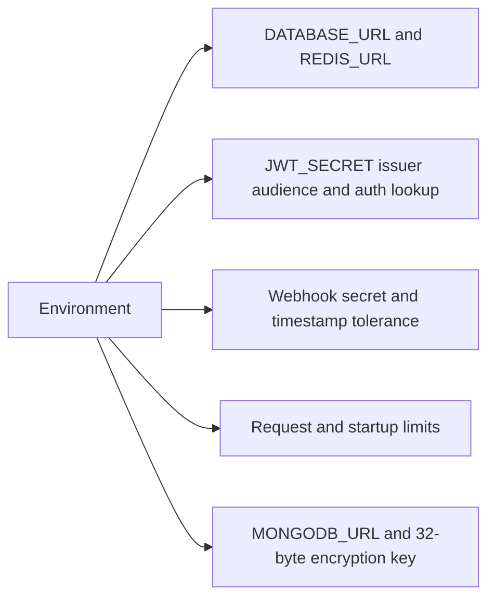

| Variable group | Required behavior |
| --- | --- |
| `DATABASE_URL` | PostgreSQL connection used by Prisma |
| `REDIS_URL` | Redis connection used by BullMQ and readiness |
| `JWT_SECRET` | At least 32 characters; use a random secret |
| `JWT_ISSUER`, `JWT_AUDIENCE` | Must match the identity issuer and client |
| `ACCESS_TOKEN_TTL_SECONDS`, `REFRESH_TOKEN_TTL_SECONDS` | Short-lived access token and rotating refresh-session lifetimes |
| `AUTH_REQUIRE_USER_LOOKUP` | Keep `true` outside isolated tests; production rejects `false` |
| `AUTH_COOKIE_SECURE` | Must be `true` in production; refresh tokens are HttpOnly cookies |
| `RATE_LIMIT_STORE` | Use `redis` in production for shared limits |
| `RUN_WORKERS`, `RECONCILIATION_SWEEP_INTERVAL_SECONDS` | Choose embedded or separate workers and sweep interval |
| `IDEMPOTENCY_TTL_SECONDS` | Retention for durable request fingerprints and response replay |
| `PAYMENT_WEBHOOK_SECRET` | Provider HMAC secret |
| `MONGODB_URL` and `MONGODB_ENCRYPTION_KEY` | Both required to enable optional MongoDB |
| `DATABASE_SSL_MODE` | `require` is enforced in production |

## CI And Release

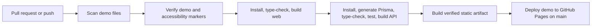

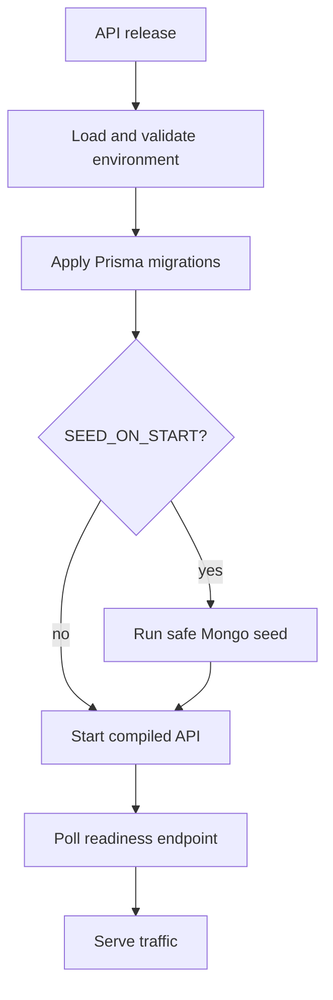

The API release command is `npm run release` from `apps/api`. It stops on failed configuration, migration, seed, startup, or readiness checks.

## Tests And Checks

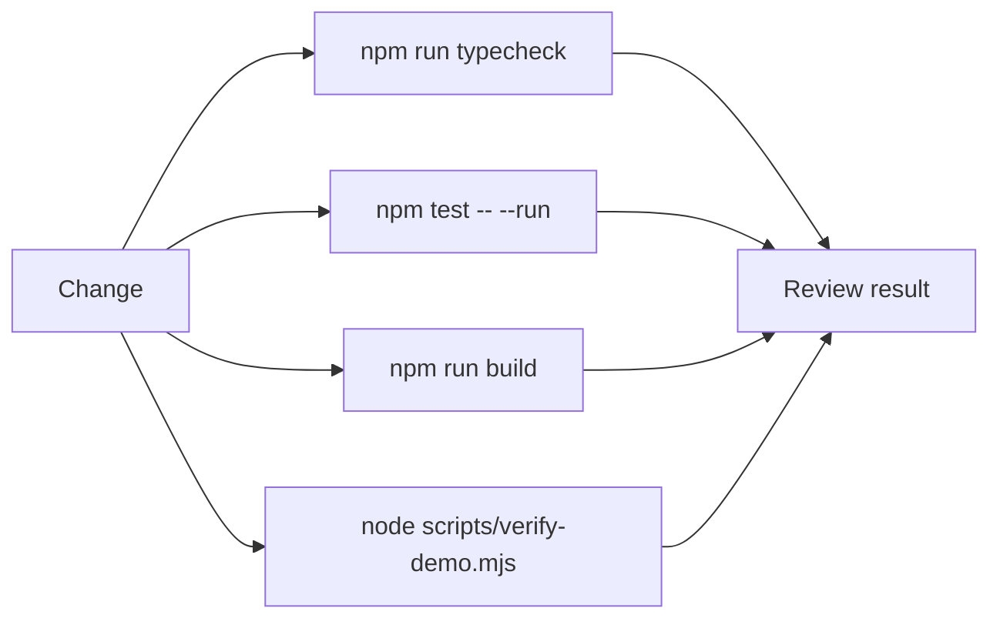

API checks:

```bash
cd apps/api
npm run typecheck
npm test -- --run
npm run build
npx prisma validate
npx prisma generate
npm run audit:prod
```

Repository and web checks:

```bash
node scripts/verify-demo.mjs
cd apps/web
npm run typecheck
npm run build
```

The API test suite covers 96 passing cases, including JWT claims, database-backed identity matching, RBAC permissions, state transitions, queue identity, webhook contracts, route behavior, and encrypted MongoDB documents.

## Contributing

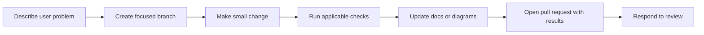

Read [`CONTRIBUTING.md`](CONTRIBUTING.md) for the complete working agreement.

## Troubleshooting

```mermaid
flowchart TD
  Failure[Something fails] --> Install{Dependency install?}
  Install -->|yes| Node[Check Node 20 and run npm ci in the app directory]
  Install -->|no| Ready{API readiness is 503?}
  Ready -->|yes| Dependencies[Check PostgreSQL, Redis, then optional MongoDB]
  Ready -->|no| Prisma{Prisma error?}
  Prisma -->|yes| Database[Check DATABASE_URL and run prisma generate]
  Prisma -->|no| Demo{Demo action missing in API?}
  Demo -->|yes| Local[Expected: demo actions use local browser state]
  Demo -->|no| Logs[Read request id and API logs]
```

## Current Boundaries

```mermaid
flowchart TB
  Ready[Ready now] --> Demo[Explorable fictional demo]
  Ready --> API[Validated API contracts]
  Ready --> Auth[JWT and RBAC enforcement]
  Ready --> Jobs[Webhook and reconciliation workers]
  Next[Next integration] --> Providers[Real payment, carrier, notification adapters]
  Next --> Login[Real login and invitation UI]
  Next --> Observability[Production metrics and alerting]
```

The demo and Next.js workspace do not yet share one live data client. Payment, carrier, notification, and storage providers remain contracts or adapters rather than live production integrations.

## License

Neev is released under the [MIT License](LICENSE). Copyright 2026 Abhishek Kumar Gautam.
