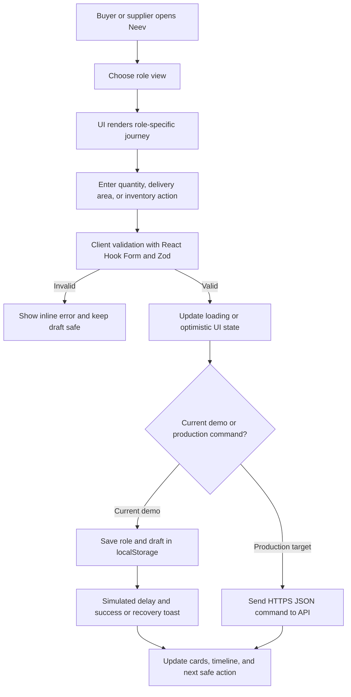
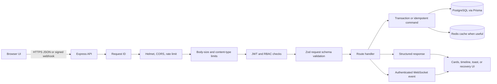
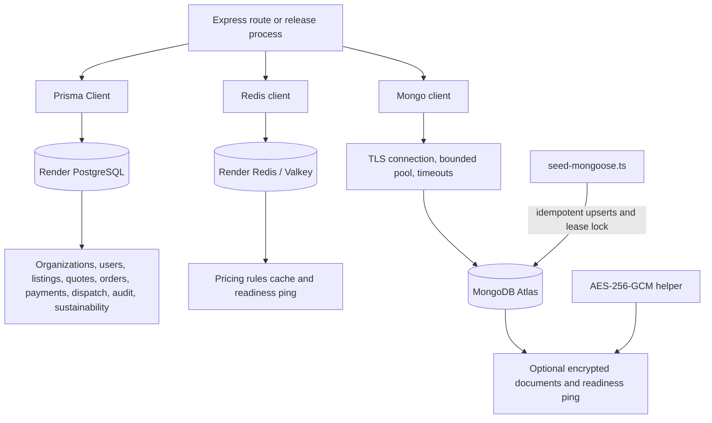
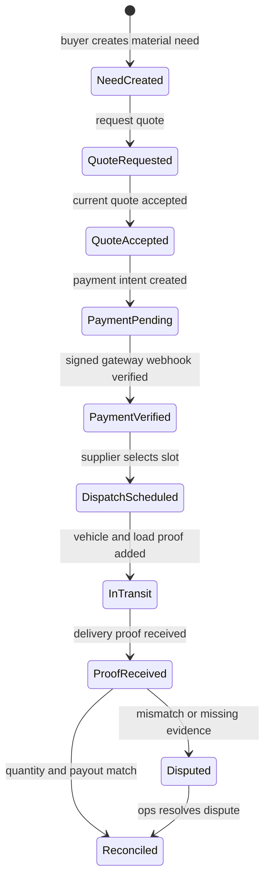
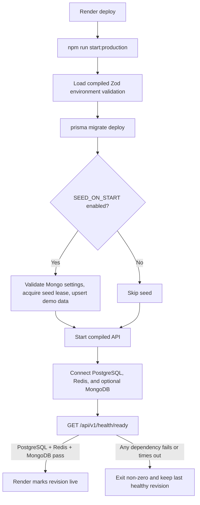

# Neev

Neev is a hyper-local B2C/B2B red-brick marketplace prototype for the NCR East launch zone. The product is designed around one calm principle: show the real cost, the next safe action, and who is allowed to take it.

## What Is In This Repository

| File | Purpose |
| --- | --- |
| `index.html` | Public responsive homepage with the Core Journeys section. |
| `workspace.html` | Non-HR operations workspace proof from the original PRD. |
| `apps/web/` | Next.js 15 frontend scaffold for the Executive Summary and accessible UI primitives. |
| `apps/api/` | Express 5 + Prisma API scaffold with PostgreSQL, Redis, JWT/RBAC, WebSockets, and tests. |
| `scripts/verify-demo.mjs` | Static checks for both pages, required markers, JavaScript syntax, and obvious secrets. |
| `.github/workflows/ci.yml` | Pull-request checks, preview artifact creation, and GitHub Pages deployment. |

The UI uses Helvetica Neue first, with system sans-serif fallbacks. It uses dark surfaces, thin borders, generous spacing, restrained motion, and direct actions rather than a dense dashboard aesthetic.

## System Workflow Diagrams

The repository has two frontend layers: the no-build demo (`index.html` and `workspace.html`) and the production-shaped Next.js scaffold in `apps/web`. The demo and current Next.js summary use local state, browser persistence, and simulated latency. The API contract and data services are implemented separately so the UI can be connected without changing the product workflow.

### 1. Frontend UI/UX Flow

This is how a user moves through the interface before any server command is sent:



Frontend responsibilities:

- `apps/web/components/executive-summary.tsx` owns the role switch, form validation, loading state, toast feedback, and local draft persistence.
- `index.html` and `workspace.html` are deterministic demo artifacts; they do not claim that a payment, dispatch, or remote write succeeded.
- `apps/web` provides the production-shaped component and UI primitives. Its `/workspace` route is the handoff point for the full operations workspace.
- Sensitive payment data is never stored in localStorage. Local storage contains only role, draft, and demo interaction state.

### 2. Frontend-to-Backend Request Flow

When the production UI is connected to the API, every state-changing action follows this boundary:



The API applies validation again even when the browser already validated the form. A timeout is treated as `pending`; the client should query by `requestId` before retrying. Quote versions, idempotency keys, role permissions, and organization ownership prevent duplicate or unauthorized writes.

### 3. Backend-to-Database Communication

Neev uses PostgreSQL for transactional marketplace records and MongoDB as an optional document/demo store. These are separate responsibilities, not interchangeable databases:



Database responsibilities:

- **PostgreSQL + Prisma** is the source of truth for business transactions. Prisma migrations create and evolve the relational schema, and route handlers use parameterized queries.
- **Redis** is used for pricing-rule caching and dependency readiness. Cache misses fall back to versioned defaults.
- **MongoDB Atlas** is optional in the API runtime. `connectMongo()` validates the encryption key, uses TLS and bounded timeouts, and powers readiness checks. The encrypted document helpers use AES-256-GCM.
- **Mongoose seed data** is written by `apps/api/scripts/seed-mongoose.ts` into tagged demo collections. The seed is idempotent and does not delete unrelated MongoDB data.
- The current domain routes primarily read and write PostgreSQL. MongoDB seed/readiness/encrypted-store support is available as a separate boundary for document-shaped data.

### 4. Marketplace State Flow

The user-visible journey and the backend order ledger follow the same sequence:



Each transition writes the new state and its audit event in one transaction where applicable. Repeated payment webhooks and commands with the same idempotency key return the known outcome instead of creating duplicate orders or payments.

### 5. Production Release and Readiness Flow

Render uses the same startup path for a safe deploy and for a restart:



The liveness endpoint only proves that the process is running. The readiness endpoint verifies each configured dependency and returns `503` when the API cannot safely serve requests.

### Implementation Status

| Boundary | Current state | Main code path |
| --- | --- | --- |
| UI/UX demo | Implemented with role views, validation, loading states, local drafts, recovery toasts, and responsive cards. | `index.html`, `workspace.html`, `apps/web/components/executive-summary.tsx` |
| Frontend to API | API contract and route shapes are implemented; the demo UI still simulates commands locally. | `README.md` routes table, `apps/api/src/app.ts` |
| Transactional database | Implemented through Prisma migrations and PostgreSQL. | `apps/api/prisma/schema.prisma`, `apps/api/src/lib/prisma.ts` |
| Cache and readiness | Implemented through Redis/Valkey. | `apps/api/src/lib/redis.ts`, `apps/api/src/routes/health.ts` |
| MongoDB | Startup connection, readiness ping, encrypted document helpers, and idempotent Mongoose seed are implemented. | `apps/api/src/lib/mongo.ts`, `apps/api/scripts/seed-mongoose.ts` |
| Payments and dispatch providers | Contract and state boundaries exist; real external provider adapters remain a production integration task. | `apps/api/src/routes/payments.ts`, `apps/api/src/routes/dispatches.ts` |

## Run Locally

Open `index.html` in a browser for the public homepage. Open `workspace.html` for the operations view. No build step is required.

The production-shaped apps are intentionally separate from the no-build demo:

```bash
cd apps/web
npm ci
cp .env.example .env.local
npm run dev
```

In a second terminal, start the API after PostgreSQL and Redis are available:

```bash
cd apps/api
npm ci
cp .env.example .env
npx prisma generate
npx prisma migrate dev --name init
npm run dev
```

To seed a configured MongoDB Atlas database with the PRD fixtures, set `MONGODB_URI` (or `MONGODB_URL`) in `apps/api/.env` and run:

```bash
cd apps/api
npm run seed:mongoose
```

The idempotent Mongoose seeder creates the PRD demo volumes of 12 users, 8 vendors, 24 products, 24 inventory snapshots, 18 orders, and 30 quotes, plus pricing tiers, volume discounts, logistics fees, tax rates, sustainability metrics, five explicit edge-case fixtures, and a seed-run record. It upserts only documents tagged with its seed version and never deletes unrelated data.

### Production Release Workflow

The API release is intentionally fail-closed. Render runs `npm run start:production` from `apps/api`; the release runner validates the environment through the compiled Zod schema, applies committed Prisma migrations with `prisma migrate deploy`, optionally runs the MongoDB seed when `SEED_ON_START=true`, starts the compiled server, and waits for `/api/v1/health/ready` before declaring the process ready.

- Set `DATABASE_SSL_MODE=require` in production. The Prisma client also appends bounded `connection_limit` and `pool_timeout` values from `DATABASE_POOL_SIZE` and `DATABASE_POOL_TIMEOUT_SECONDS`.
- Set `MONGODB_URI` and `MONGODB_URL` to the same Atlas URL when both are present. `MONGODB_ENCRYPTION_KEY` must be base64 and decode to exactly 32 bytes; Atlas connections use TLS by default.
- Keep `STARTUP_TIMEOUT_MS`, `SHUTDOWN_TIMEOUT_MS`, `HEALTH_CHECK_TIMEOUT_MS`, and `SEED_TIMEOUT_MS` bounded. A timeout exits the release instead of serving a partially initialized API.
- `SEED_ON_START=false` is the safe default. Enable it for the demo environment only; the seed is idempotent, validates all Mongo settings, uses bounded connection/socket timeouts, and takes a lease-based Mongo lock so concurrent deploys cannot seed at the same time.
- A failed migration, seed, or readiness check returns a non-zero exit code. Render keeps the last healthy revision available for rollback; database migrations are forward-only and are never destructively auto-reversed.
- SIGTERM and SIGINT are forwarded through the release runner. The API closes its HTTP listener and disconnects PostgreSQL, Redis, and MongoDB within the shutdown timeout. Unexpected exceptions exit non-zero so Render's restart policy can recover the service.
- Render's `/api/v1/health/live` endpoint is liveness-only. `/api/v1/health/ready` checks PostgreSQL, Redis, and configured MongoDB independently with per-check timeouts and returns `503` when any dependency is unavailable.
- Run `npm run test:ci` for the Vitest contract suite, `npm run typecheck` and `npm run build` for compile checks, and `npm run audit:prod` for the production dependency audit. The repository uses Vitest; Jest is not required by this project.
- Do not commit `.env` files, Atlas URLs, passwords, JWT secrets, webhook secrets, or encryption keys. Store them in Render environment variables and rotate them through Render when compromised.

The API exposes `GET /api/v1/health/live` without dependencies and `GET /api/v1/health/ready` when PostgreSQL and Redis are connected. JWTs are expected to carry `sub`, `organizationId`, and a non-empty `roles` array. Webhook requests must carry an HMAC-SHA256 signature. Never use the example JWT or webhook secrets in production.

The demo stores non-sensitive state in the browser:

- `neev-core-journey-v1` stores the selected buyer/supplier role, current stage, validated form drafts, and retry status.
- `neev-home-analytics-v1` stores the last 100 anonymous interaction events.
- No card number, CVV, payment token, password, or Gemini key is written to local storage.

The page is deliberately usable offline after its HTML and image assets have been cached. Offline actions become local drafts and never claim that a payment or dispatch succeeded.

## Core Journeys

The homepage section at `#journeys` has one shared state model with two role-specific paths. A role switch, stage rail, handoff diagram, performance metrics, validation checkpoint, and recovery path are rendered from the same journey data.

### Buyer: Search To Payment

1. **Search**: capture the build need, filter by brick grade, freshness, location, and quantity, then return verified inventory.
2. **Compare landed cost**: calculate material price plus freight, route confidence, and tax from a timestamped rate card.
3. **Negotiate bulk terms**: send a structured quantity, delivery area, and target-date request with an idempotency key.
4. **Pay through a gateway**: create a payment intent through the Razorpay or Stripe adapter. The marketplace trusts a signed webhook, not raw card data.

Buyer validation in the demo rejects non-integer quantities, quantities below 1,000, quantities above 5,000,000, missing gateways, stale rate cards, and payment amounts that do not match the accepted quote version.

### Supplier: Inventory To Reconciliation

1. **Update inventory**: publish available pieces, price, grade, lead time, and batch evidence. Every edit increments a listing version.
2. **Accept a quote**: review the current buyer request, expiry, route, and quantity. Accepting an old quote version is blocked.
3. **Coordinate dispatch**: choose a slot, assign a vehicle, and attach proof of dispatch. Status changes are append-only events.
4. **Reconcile delivery**: match proof, order, quantity, and payout state. A mismatch opens a dispute instead of releasing funds silently.

Supplier validation in the demo rejects empty stock, invalid price, lead times outside 0-90 days, missing dispatch slots, and dispatches without an accepted quote.

## Frontend Data Flow

The static page models the same boundaries that a production client would use:

```text
user action
  -> local validation
  -> optimistic UI state
  -> idempotent API command
  -> server-side transaction
  -> event / webhook
  -> shared buyer, supplier, and operations timeline
```

The Core Journeys section shows this flow explicitly. Each stage lists the input checkpoint, the validated handoff, expected latency, role permission, and safe recovery behavior. The `Save & retry safely` action persists the current draft and records a retry event without pretending that a remote command succeeded.

## Production Backend Contract

The static pages remain deterministic demo artifacts. The `apps/api` scaffold now owns the first production boundary, but it still requires real provider adapters, migrations, credentials, and integration tests before launch. It does not yet call a real payment gateway, carrier, or dispatch service.

| Route | Owner | Responsibility |
| --- | --- | --- |
| `GET /api/v1/search` | Buyer | Search verified inventory with location, grade, freshness, and quantity filters. |
| `POST /api/v1/pricing/calculate` | Buyer or Supplier | Apply cached volume tiers and return material, freight, handling, platform, carbon, tax, and total line items. |
| `POST /api/v1/quote-requests` | Buyer | Create an idempotent bulk request with quantity, site, target date, and expiry. |
| `POST /api/v1/quotes/:quoteId/accept` | Buyer or Supplier | Accept the current quote version using optimistic concurrency. |
| `POST /api/v1/payment-intents` | Buyer finance | Create an order-bound payment intent through the selected gateway adapter. |
| `POST /api/v1/payments/:gateway/webhook` | Gateway | Verify signature, amount, currency, and quote version, then advance the order ledger. |
| `PATCH /api/v1/inventory/:listingId` | Supplier | Validate and version stock, price, grade, batch, and lead time. |
| `POST /api/v1/dispatches` | Supplier operations | Create a dispatch slot, vehicle reference, and proof-of-load event. |
| `GET /api/v1/orders/:orderId/timeline` | All permitted roles | Return the append-only buyer, supplier, payment, and delivery timeline. |
| `GET /api/v1/sustainability/metrics` | All permitted roles | Aggregate organization-scoped baseline, actual, reduced, and recycled-share metrics. |
| `POST /api/v1/sustainability/metrics` | Supplier operations | Upsert a validated carbon measurement period with methodology and optional order link. |
| `GET /api/v1/docs` | Developers | Interactive Swagger UI backed by the OpenAPI document. |

### Implemented Scaffold Boundaries

- **Web client**: `apps/web` renders the Executive Summary with custom Tailwind tokens, Shadcn-style primitives, React Hook Form/Zod validation, skeleton loading, toast recovery, and local draft persistence.
- **API service**: `apps/api` validates request schemas, applies JWT/RBAC, attaches request IDs, emits structured logs, and owns transaction boundaries.
- **PostgreSQL + Prisma**: `apps/api/prisma/schema.prisma` models organizations, users, inventory snapshots, quote requests, quotes, orders, payment intents, dispatch events, audit events, and indexed sustainability periods. Prisma appends pool settings from `DATABASE_POOL_SIZE` and `DATABASE_POOL_TIMEOUT_SECONDS`.
- **Redis**: readiness checks and pricing-rule caching are implemented. The pricing rules cache has a five-minute TTL and safely falls back to versioned defaults if Redis is unavailable.
- **MongoDB encrypted store**: optional MongoDB access uses a bounded client pool and application-level AES-256-GCM encryption for documents. Configure `MONGODB_URL` and a base64-encoded 32-byte `MONGODB_ENCRYPTION_KEY` together; the API refuses partial configuration.
- **WebSocket updates**: authenticated organization-scoped `/ws` connections receive dispatch and quote events, enforce a message-size limit, and use heartbeat cleanup.
- **Pricing module**: `POST /api/v1/pricing/calculate` uses Decimal arithmetic, volume discount basis points, distance freight, per-piece handling, platform fee, carbon contribution, and tax to return a traceable breakdown.
- **Sustainability module**: metrics are stored as baseline/actual kilograms, derived reduction, recycled share, methodology, period, organization, and optional order evidence. Reads return totals plus a chronological trend.
- **Security boundary**: strict JSON, URL-encoded, multipart, webhook, and WebSocket limits; CORS; Helmet; rate limiting; JWT/RBAC; request IDs; redacted Pino logs; security rejection events; and parameterized Prisma queries instead of interpolated SQL.
- **API documentation**: `/api/v1/docs` serves Swagger UI and `/api/v1/docs/openapi.json` serves the machine-readable contract.
- **Object storage**: batch certificates, vehicle documents, proof-of-load, and delivery evidence with signed URLs.
- **Worker queue**: payment webhooks, carrier updates, notification retries, payout reconciliation, and stale-rate-card refreshes.
- **Gateway adapters**: one interface for Razorpay and Stripe so the order service never depends on provider-specific payloads.

### Order State Machine

```text
need.created
  -> quote.requested
  -> quote.accepted
  -> payment.pending
  -> payment.verified
  -> dispatch.scheduled
  -> dispatch.in_transit
  -> delivery.proof_received
  -> order.reconciled
```

Every transition should be an authenticated command that writes the new state and an audit event in one database transaction. Webhooks and carrier callbacks must be idempotent. A repeated webhook returns the already-known outcome instead of creating a second payment or payout.

## Role-Based Access Control

The UI exposes the intended permission boundary; the backend must enforce it again on every route.

| Role | Can do | Cannot do |
| --- | --- | --- |
| `buyer` | Search, compare, request quotes, view own orders. | Change supplier inventory or release payment. |
| `buyer_finance` | Create or confirm payment intents for the buyer organization. | Edit supplier terms or dispatch events. |
| `supplier` | Edit owned inventory, view assigned requests, accept or counter quotes. | Read another supplier's inventory or alter payment ledger state. |
| `supplier_ops` | Schedule dispatch, attach vehicle and proof events for owned orders. | Change accepted commercial terms. |
| `ops_admin` | Verify vendors, resolve disputes, reconcile exceptions, inspect audit history. | Read raw payment credentials. |

Use organization-scoped authorization, not only a role string. A supplier may edit only its own listing IDs, and a buyer may read only its organization orders.

## Validation And Recovery Rules

- Validate on the client for fast feedback and on the API for trust.
- Carry `requestId`, `quoteVersion`, `idempotencyKey`, and `occurredAt` on every state-changing command.
- Treat network timeout as `pending`, not `failed`, until the server is queried by request ID.
- Treat a stale quote or rate card as a conflict that needs a fresh read, not as a silent overwrite.
- Keep failed inventory and dispatch edits as local drafts with the last published version visible.
- Retry webhook, carrier, and notification work with exponential backoff and a dead-letter queue.
- Open a dispute when delivery proof and order quantity do not reconcile; never release a payout by guessing.
- Keep user-facing errors short and actionable: what was blocked, why, and the safe next action.

## Performance And Accessibility Targets

The Core Journeys cards display the most important workflow SLOs. Production targets are:

- Largest Contentful Paint below 2.5 seconds on a mid-tier mobile device.
- Interaction to Next Paint below 200 milliseconds for role and stage changes.
- Cumulative Layout Shift below 0.1 by reserving image and journey-panel space.
- Search p95 below 400 milliseconds and landed-cost comparison p95 below 600 milliseconds.
- Inventory save p95 below 800 milliseconds and buyer/supplier status sync below 2 seconds.
- Payment webhook verification below 5 seconds after gateway delivery.
- Keyboard focus rings, labelled controls, `aria-live` statuses, reduced-motion support, and touch targets of at least 44px.
- Lazy-loaded product images, no blocking third-party scripts, and no horizontal overflow at 320px width.

## CI/CD

`.github/workflows/ci.yml` runs on pull requests and pushes to `main`:

1. Checks `index.html` and `workspace.html` for obvious secrets.
2. Runs `node scripts/verify-demo.mjs` for required markers and JavaScript syntax.
3. Installs and type-checks/builds `apps/web`.
4. Generates Prisma Client, type-checks `apps/api`, and runs its dependency-free HTTP contract tests.
5. Runs `git diff --check`.
6. Builds a Pages artifact containing both `index.html` and `workspace.html`.
7. Deploys the verified artifact to GitHub Pages after a successful push to `main`.

Run the local checks with:

```bash
node scripts/verify-demo.mjs
```

## Prototype Boundary

The fictional suppliers, prices, inventory, reviews, gateway labels, and delivery statuses are demo data. The page demonstrates the product behavior and the backend contract; it does not authorize real payments, reserve real stock, send SMS, dispatch a real truck, or persist data outside the browser. Production work starts by implementing the API routes and state machine above, then replacing the local journey store with authenticated server responses and an IndexedDB sync queue.
