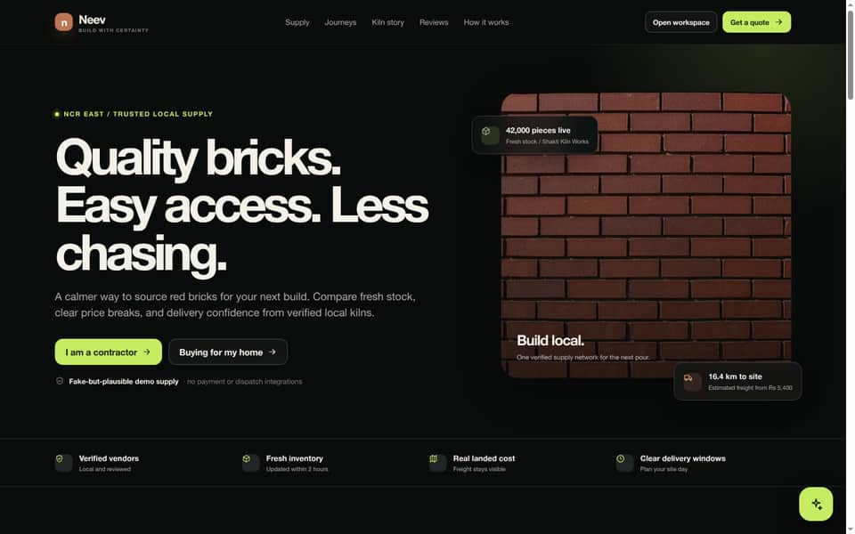
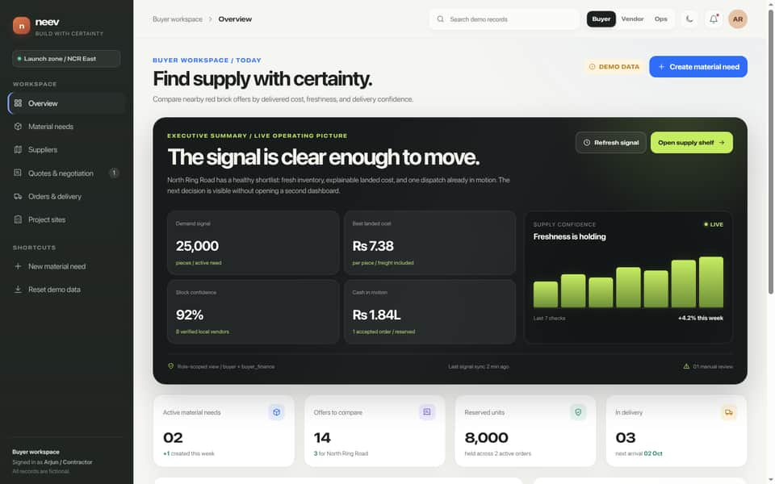
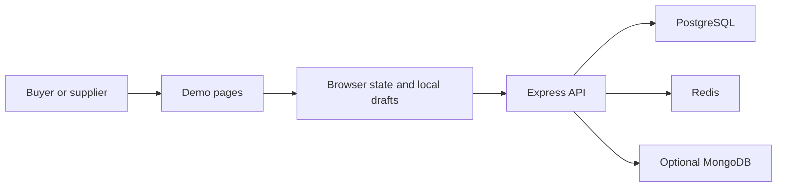
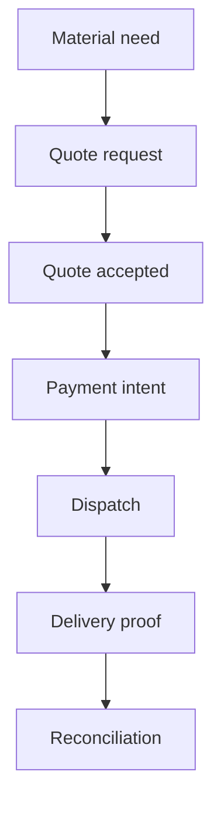

# Neev

Neev is a prototype marketplace for buying red bricks from local kilns in the NCR East launch area. It is meant to make a common building purchase easier: describe the need, compare real delivered cost, choose a supplier, and track what happens next.

This repository contains both a polished browser demo and a production-shaped API. The demo is safe to explore, but it uses fictional records and local browser state. It does not take real payments, reserve real stock, or send a truck.

**Live demo:** [neev-web.onrender.com](https://neev-web.onrender.com)  
**API readiness:** [neev-api-adnc.onrender.com/api/v1/health/ready](https://neev-api-adnc.onrender.com/api/v1/health/ready)

## Screenshots

These screenshots come from the live demo. They show the public homepage and the buyer workspace. All names, prices, stock counts, and orders are fictional.

<p align="center">
  
  
</p>

## Why Neev Exists

Small builders often find material through calls, messages, and incomplete price quotes. That makes it hard to answer simple questions: Is the stock fresh? What is the delivered price? Can the supplier deliver on the needed date? What happens if the quantity is wrong?

Neev is designed around clear answers. A buyer can search by brick grade, quantity, location, freshness, and delivery date. A supplier can share stock, prices, and lead times. Operations users can review quotes, dispatch events, delivery proof, and exceptions in one place.

The first version focuses on red bricks because the workflow is easy to understand. The same pattern can later support other building materials.

## How The Pieces Fit

The simple view is:



The main order path is:



The diagrams are deliberately small. Detailed versions are in [`docs/diagrams/`](docs/diagrams/), including the API boundary, order flow, and Render release flow.

## Tech Stack

| Area | Tools | Purpose |
| --- | --- | --- |
| Public demo | HTML, CSS, browser JavaScript | Fast pages with no build step |
| Web app | Next.js 15, React 19, TypeScript, Tailwind CSS | Production-shaped workspace UI |
| API | Express 5, TypeScript, Zod | Validated HTTP routes and business rules |
| Access and events | JWT, role checks, WebSockets | Organization access and live updates |
| Data | PostgreSQL, Prisma, Redis, optional MongoDB | Transactions, cache, readiness, and document data |
| Quality | Vitest, TypeScript, GitHub Actions | Tests, builds, type checks, and deploy gates |
| Hosting | Render and GitHub Pages | Public services and verified demo artifacts |

## User Roles

- **Buyer:** searches inventory, compares delivered cost, requests quotes, and views its orders.
- **Buyer finance:** creates or confirms payment intents for the buyer organization.
- **Supplier:** edits its own inventory and responds to quote requests.
- **Supplier operations:** schedules dispatch and adds vehicle or delivery proof.
- **Operations admin:** verifies suppliers, reviews disputes, and checks audit history.

The browser shows these role boundaries for the demo. The API must enforce them again for every real request.

## Project Map

- `index.html`: public homepage and product journey demo.
- `workspace.html`: buyer, supplier, and operations workspace demo.
- `apps/web/`: Next.js application and reusable UI components.
- `apps/api/`: Express service, Prisma schema, routes, health checks, and tests.
- `scripts/verify-demo.mjs`: checks required page content, script syntax, and obvious secrets.
- `docs/diagrams/`: detailed SVG architecture and workflow diagrams.
- `docs/screenshots/`: screenshots used in this README.
- `.github/workflows/ci.yml`: checks and GitHub Pages deployment.

## Run It Locally

You need Node.js 20 or newer. To view the demo, open `index.html` or `workspace.html` in a browser. No build step is needed.

To run the web app:

```bash
cd apps/web
npm ci
cp .env.example .env.local
npm run dev
```

To run the API, first make PostgreSQL and Redis available:

```bash
cd apps/api
npm ci
cp .env.example .env
npx prisma generate
npx prisma migrate dev --name init
npm run dev
```

MongoDB is optional. If `MONGODB_URI` or `MONGODB_URL` is configured, seed the fictional records with:

```bash
cd apps/api
npm run seed:mongoose
```

Never put real passwords, API keys, payment secrets, or encryption keys in the repository.

## Deployment And CI/CD

The API release command validates settings, applies committed Prisma migrations, optionally runs the safe MongoDB seed, starts the compiled server, and waits for the readiness check. A failed migration, seed, or dependency check stops the release instead of serving a partly ready API.

Every pull request and every push to `main` runs GitHub Actions. The workflow scans the demo pages for common secret patterns, runs the demo verifier, installs dependencies, type-checks and builds the web app, generates Prisma Client, tests and builds the API, and checks whitespace. A successful push to `main` creates and publishes the verified static demo artifact to GitHub Pages.

## Tests And Checks

Run these commands from the named directory:

```bash
node scripts/verify-demo.mjs

cd apps/api
npm run typecheck
npm test -- --run
npm run build
npm run audit:prod

cd ../web
npm run typecheck
npm run build
```

The API test suite currently has 10 passing tests. The public readiness endpoint checks PostgreSQL, Redis, and configured MongoDB separately and returns `503` when the API cannot safely serve requests.

## Contribution Guide

1. Create a branch from `main`.
2. Keep changes small and explain the user problem they solve.
3. Run the demo verifier, API tests, type checks, and builds that apply to your change.
4. Keep demo data clearly fictional and do not claim that local actions completed on a remote service.
5. Update the README or diagrams when behavior, setup, or deployment changes.
6. Open a pull request with a short summary and test results.

There is no separate contribution file yet, so this section is the working guide.

## Code Of Conduct

Be respectful, patient, and clear. Discuss code and decisions, not people. Do not harass, threaten, expose private information, or submit knowingly unsafe code. Maintainers may remove abusive comments or close contributions that do not follow these rules.

## Troubleshooting

- **`npm ci` fails:** use Node 20 or newer and run the command inside `apps/web` or `apps/api`.
- **Prisma cannot connect:** check the database URL, make sure PostgreSQL is running, then run `npx prisma generate`.
- **The API returns `503`:** open the readiness URL and check PostgreSQL, Redis, and MongoDB settings one at a time.
- **A demo action does not appear in the API:** this is expected. The static demo saves local drafts and simulates network delay.
- **A Mermaid diagram fails on GitHub:** keep node labels short and avoid advanced styling. Use the SVG diagrams in `docs/diagrams/` when a detailed diagram is needed.

## Known Issues

The Next.js workspace and the no-build demo are two layers, so they do not yet share one live data client. Payment gateway, carrier, notification, and dispatch providers are contracts only. Real authentication, external webhooks, background workers, and production provider adapters still need integration work.

## Roadmap

- Connect the Next.js workspace to authenticated API responses.
- Add real provider adapters for payments, delivery, notifications, and object storage.
- Add an organization setup flow with real login and invitation rules.
- Add background jobs for webhook retries, carrier updates, and payout reconciliation.
- Add more materials, supplier regions, and stronger production monitoring.

## License

Neev is released under the [MIT License](LICENSE). Copyright 2026 Abhishek Kumar Gautam.
