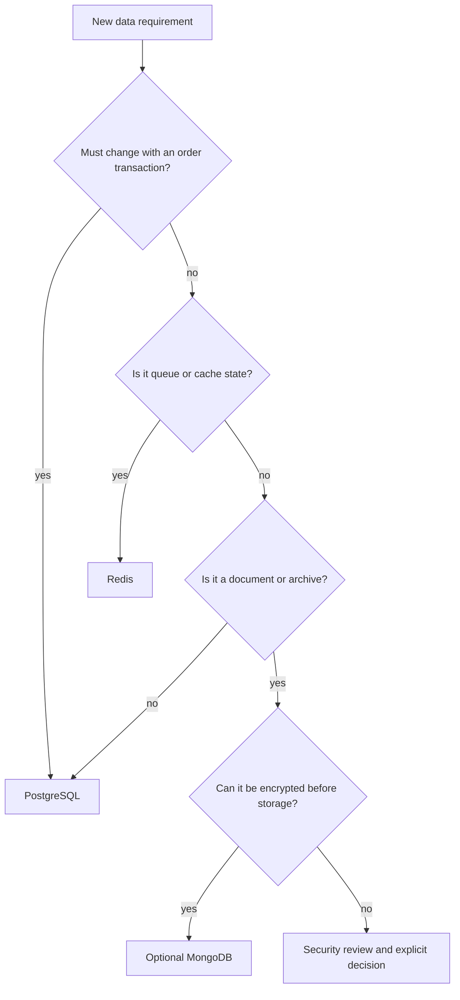
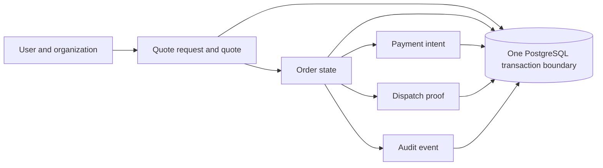
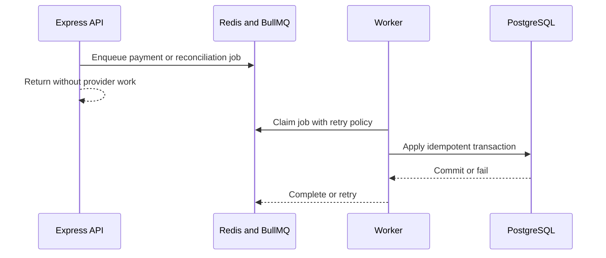
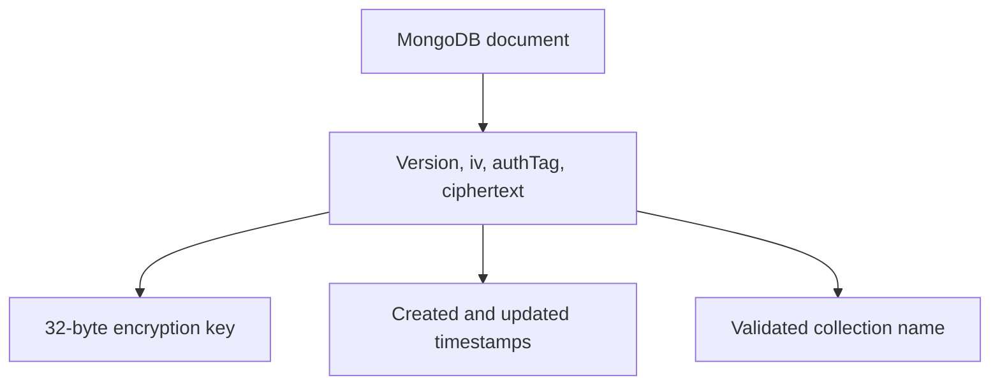
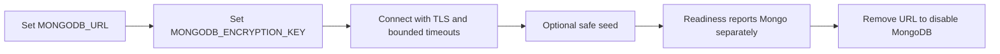

# Database Decision

## Decision

PostgreSQL is Neev's source of truth for marketplace transactions. Redis is the operational store for queues and short-lived coordination. MongoDB is optional and limited to encrypted document or archive use cases.

## Why PostgreSQL Owns Transactions

These records need relational constraints, organization-scoped queries, unique idempotency keys, and atomic state transitions. Splitting them across databases would create reconciliation work at the point where correctness matters most.

## Why Redis Owns Jobs

Redis is not the source of truth for payment or order state. A lost or expired queue job can be recreated from the webhook ledger or operational trigger; the durable result is always written to PostgreSQL.

## When MongoDB Is Appropriate

MongoDB may store a large, encrypted document that does not need to participate in an order transaction. Examples include a provider payload archive or a future document-heavy compliance record. The current helper uses AES-256-GCM and refuses missing or incorrectly sized keys.

MongoDB must not become the owner of:

- users, roles, organizations, or permissions
- inventory availability or price authority
- quote acceptance or order status
- payment verification or reconciliation results
- audit events needed to explain a transaction

## Operational Rules

- `MONGODB_URL` and `MONGODB_ENCRYPTION_KEY` must be supplied together.
- The key must decode from base64 to exactly 32 bytes.
- TLS is enabled by default.
- MongoDB failure must not silently replace PostgreSQL data.
- Production migrations remain Prisma migrations against PostgreSQL.
- A future MongoDB collection needs a retention, access, and deletion policy before use.
